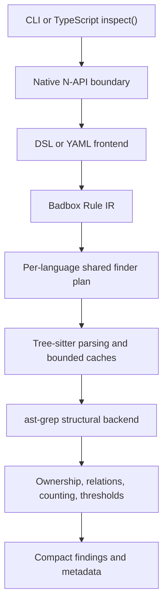

# Badbox

Deterministic bad-pattern detection for codebases.

Badbox lets a repository encode questionable engineering patterns as structural rules, then check
for them without an LLM. It reports evidence—where a pattern occurred, who owns it, and how often—
while leaving the decision to a developer or coding agent.

Badbox ships no default policies and performs no automatic rewriting. Each project owns its rules
under `.badbox/`.

Current npm version: `0.3.0`

Current rule format: `#badbox 1` (experimental)

## Contents

- [Install](#install)
- [Quick start](#quick-start)
- [How Badbox works](#how-badbox-works)
- [Write rules](#write-rules)
- [Capabilities](#capabilities)
- [Supported languages](#supported-languages)
- [CLI](#cli)
- [Programmatic API](#programmatic-api)
- [Architecture](#architecture)
- [Current boundaries](#current-boundaries)
- [Development](#development)
- [Releasing](#releasing)
- [License](#license)

## Install

Badbox requires [Bun](https://bun.sh/) 1.3.14 or newer.

Install it in a project:

```bash
bun add --dev badbox
```

Then run it through `bunx`:

```bash
bunx badbox check
```

You can also install the CLI globally:

```bash
bun add --global badbox
badbox check
```

Published packages include prebuilt native engines for these platforms:

| Platform | Architecture | Native package |
| --- | --- | --- |
| macOS | Apple Silicon | `badbox-darwin-arm64` |
| macOS | Intel | `badbox-darwin-x64` |
| Linux GNU | arm64 | `badbox-linux-arm64-gnu` |
| Linux GNU | x64 | `badbox-linux-x64-gnu` |
| Windows | x64 | `badbox-windows-x64` |

Installing from npm on a supported platform does not require a local Rust toolchain.

## Quick start

Run `create` from the root of the project you want to check:

```bash
bunx badbox create project-rules.badbox
```

Badbox creates `.badbox/project-rules.badbox` with the correct version header and an editable
example. Replace that example with a rule for your project:

```text
#badbox 1

rule rust/excessive-clones for rust {
  summary "Function contains more clone calls than the configured limit"
  param limit = 4

  find code(value) `value.clone()`
  group by nearest callable
  when count > limit

  report {
    severity warning
    message "Function contains excessive clone calls"
    evidence "clone call sites"
  }
}
```

Check the project:

```bash
bunx badbox check
```

Or check specific source roots while still loading rules from the project's `.badbox/` directory:

```bash
bunx badbox check src packages
```

A finding is an observation, so findings do not make the command fail. Invalid rules, invalid
input, unreadable files, I/O errors, and syntax diagnostics make the check incomplete and return a
nonzero exit code.

## How Badbox works

A rule selects syntax, assigns each match to an owner, applies structural conditions, counts the
remaining matches, and reports owners above a threshold.

```text
find -> where -> nearest owner -> distinct-range count -> threshold -> finding
```

This makes rules useful for patterns such as:

- excessive cloning, casting, unwrapping, or goroutine creation per function;
- syntax inside a loop or another structural boundary;
- an owner that contains or lacks supporting evidence;
- one statement following or preceding another in the same lexical block;
- repository-specific architectural patterns that should not reappear.

Badbox detects which supported languages occur under the requested source roots and runs only the
relevant rules.

## Write rules

The tiny DSL is the primary rule format. Every file starts with a version header:

```text
#badbox 1
```

### Structural captures

Names declared in `code(...)` become structural captures:

```text
find code(value) `value.clone()`
```

Undeclared identifiers remain literal source syntax. Captures can also be constrained by text:

```text
where text(method) in ["unwrap", "expect"]
```

Supported text operators are `==`, `!=`, `in`, `not in`, and `matches`.

### Structural relations

Rules can inspect containment and evidence around a selected match:

```text
where match inside any {
  node for_statement
  node while_statement
}

where group lacks any {
  code(ctx) `ctx.cancel()`
}
```

Ordering relations compare statements in the same nearest callable and lexical block:

```text
find code(statement) `statement.clearBindings()`
group by nearest callable

where match follows any {
  code(statement) `statement.reset()`
}
```

Repeating `statement` in both selectors requires the captured source text to be equal. Therefore,
`first.reset()` does not satisfy a later `second.clearBindings()` match. Intervening sibling
statements are allowed; nested callables and different branch, loop, switch, or error-handling
blocks remain separate.

See the [tiny DSL reference](native/tiny-dsl/README.md) for the complete grammar, validation rules,
relations, parameters, and fixture declarations. Runnable DSL examples live under
[`examples/rules`](examples/rules). YAML equivalents under [`examples/yaml`](examples/yaml) exercise
the compatibility frontend; they are never loaded automatically.

## Capabilities

| Area | Supported today |
| --- | --- |
| Selection | Source-shaped `code(...)` patterns and raw syntax-node kinds |
| Ownership | Nearest callable for Rust, Go, PowerShell, and Zig; explicit nearest node kinds elsewhere |
| Capture predicates | `==`, `!=`, `in`, `not in`, and Rust-regex `matches` |
| Containment | `where match inside any\|all` |
| Owner evidence | `where group has any\|all` and `where group lacks any\|all` |
| Ordering | Statement-level `follows` and `precedes` within one callable and lexical block |
| Aggregation | Distinct selected ranges counted per owner with strict `count > threshold` |
| Parameters | Rule-local scalar defaults with programmatic overrides |
| Frontends | Tiny DSL plus YAML compatibility, both compiled to the same Badbox Rule IR |
| Output | Deterministically ordered, bounded findings with exact total counts |

## Supported languages

Badbox bundles 30 parsers.

The 28 ast-grep built-in languages are Bash, C, C++, C#, CSS, Dart, Elixir, Go, Haskell, HCL,
HTML, Java, JavaScript/JSX, JSON, Kotlin, Lua, Markdown, Nix, PHP, Python, Ruby, Rust, Scala,
Solidity, Swift, TSX, TypeScript, and YAML.

Badbox also statically links PowerShell and Zig parsers.

File extensions select relevant language rules. This is language detection, not framework,
dependency, build-configuration, or semantic type detection.

## CLI

```text
badbox create <name.badbox>
badbox check [path ...]
```

### `create`

Creates `.badbox/<name.badbox>` with the current version header and a Rust example. The name may
include subdirectories under `.badbox/`. Badbox refuses absolute paths, parent traversal, names
without the `.badbox` suffix, and existing files.

### `check`

Recursively loads `.badbox`, `.yaml`, and `.yml` rule files from the current project's `.badbox/`
directory. With no source paths, it checks the current project. Explicit source paths narrow source
discovery but do not change where rules are loaded from.

Discovery respects ignore files and hidden paths, skips common build and vendor directories, and
does not follow nested symlinks.

## Programmatic API

Use `badbox/checker` when another tool or coding agent needs structured results:

```ts
import { inspect, iterateFindings } from "badbox/checker";

const result = await inspect({
  paths: ["./src"],
  rulePaths: ["./.badbox"],
  parameters: {
    "rust/excessive-clones.limit": 6,
  },
  maxFindings: 1_000,
});

for (const finding of iterateFindings(result)) {
  console.log({
    rule: finding.rule.id,
    file: finding.file,
    owner: [finding.ownerStart, finding.ownerEnd],
    observed: finding.observed,
  });
}

if (result.diagnostics.length > 0) {
  console.error(result.diagnostics);
}
```

`inspect()` also accepts:

- `threshold` to replace every loaded rule's threshold;
- `profile: true` to include phase timings and cache/execution counters;
- `maxFindings` to bound returned records while retaining the exact `findingCount`.

Findings are stored as five `u32` values: file ID, rule ID, owner start, owner end, and observed
count. File paths and rule metadata are interned separately. Use `iterateFindings()` to decode the
records without materializing another result array.

## Architecture



Parsing, matching, ownership, relational evaluation, counting, thresholds, and compact result
construction run in Rust. TypeScript invokes the native engine and decodes metadata.

Badbox owns the Rule IR and structural-backend interface; ast-grep is an implementation detail.
Identical primary and relational selectors are interned across a language plan and dispatched once
per relevant AST node. Rule-specific predicates, ownership, thresholds, and reporting remain
independent.

File work uses at most four native workers. Compiled-rule, parsed-file, and compact-result caches
are content-validated, process-local, and bounded. Parallel results are sorted before returning so
output remains deterministic.

## Current boundaries

- Badbox reports lexical and structural evidence, not runtime behavior or developer intent.
- There is no type resolution, macro expansion, conditional-compilation filtering, SQL query-plan
  analysis, leak proof, or transaction-atomicity proof.
- Counts describe syntax sites, not runtime execution counts or costs.
- Immediate-sibling ordering is not implemented. `follows` and `precedes` allow intervening sibling
  statements.
- Ordering by nearest callable currently targets Rust, Go, PowerShell, and Zig.
- Only strict greater-than count aggregation is implemented.
- Syntax-error files produce diagnostics and no partial findings.
- Caches do not survive a CLI process and still read file contents for validation.
- Findings are bounded to 10,000 records by default. Increasing `maxFindings` adds 20 bytes per
  returned finding.
- Rule format version `1` remains experimental.

## Development

Building from source requires Bun, Rust/Cargo, `cargo-nextest`, and a C compiler for Tree-sitter
grammars.

```bash
bun install
bun run build:native
bun run ci
```

`bun run ci` is the canonical full check. It runs Rust formatting, Clippy, both `cargo-nextest`
suites, the native release build, TypeScript checking, and all Bun tests.

After changing Rust, rebuild the `.node` addon before running Bun tests:

```bash
bun run build:native
bun test tests/scanner.test.ts
```

For reproducible latency, rule-scaling, and memory measurements:

```bash
bun run build:native
bun run benchmark
bun run benchmark ../zova
```

See the [benchmark methodology](benchmarks/README.md),
[optimization report](benchmarks/OPTIMIZATION.md), and
[frozen Zova corpus](tests/fixtures/zova/README.md).

### Project layout

| Path | Purpose |
| --- | --- |
| `src/cli.ts` | `check` and `create` commands |
| `src/scanner/` | Public TypeScript API and native-addon loading |
| `native/src/rule_ir.rs` | Backend-independent rule model |
| `native/src/frontends/` | DSL/YAML lowering and validation |
| `native/src/backend/` | Structural backend contract and ast-grep implementation |
| `native/src/evaluator.rs` | Language-independent aggregation and findings |
| `native/tiny-dsl/` | Rust parser crate, tests, and DSL reference |
| `examples/` | Runnable rules that are never defaults |
| `tests/` | CLI, integration, packaging, corpus, and benchmark-contract tests |
| `benchmarks/` | Reproducible performance harness and reports |

## Releasing

All six npm packages and both Rust manifests must use the same release version. Validate that
invariant before publishing:

```bash
bun run scripts/validate-release.ts 0.3.0
bun run ci
```

After committing and pushing the version, run the **Release npm packages** GitHub Actions workflow
with that version. It builds and tests all five native targets, packages and smoke-tests the npm
tarballs, publishes the platform packages first, and publishes `badbox` last.

All six npm packages use npm trusted publishing through GitHub OIDC; no `NPM_TOKEN` is required.
Stable versions publish under `latest`, while prerelease versions publish under `next`.

## License

[MIT](LICENSE) © 2026 Octacity
